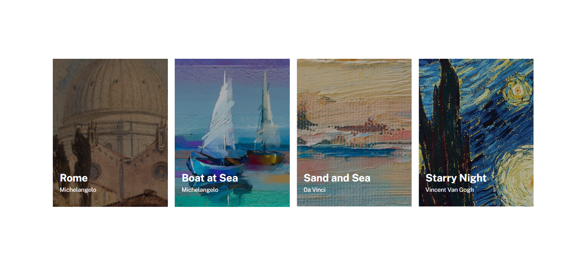

# Lista de Imagens

Projeto de lista de imagens, construído aplicando as técnicas de HTML e CSS avançados que eu aprendi no curso DevQuest. Nele foi aplicado os conceitos de responsividade com flexbox.

[Clique aqui para acessar](https://edu-almeidaf.github.io/lista-imagens/)

---

## Tecnologias Utilizadas:

- HTML
- CSS
- Git e Github

---

## Contato

[Linkedin](https://www.linkedin.com/in/almeidaedu/)